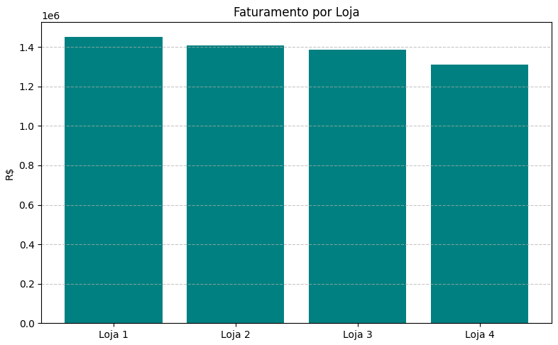
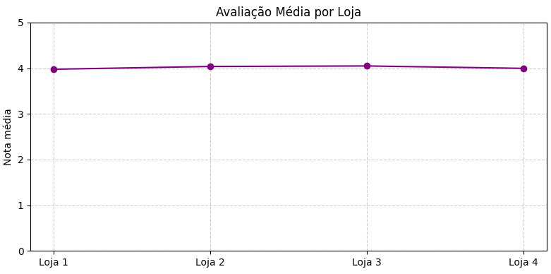
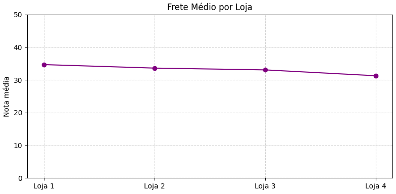

# 🛍️ Projeto de Análise de Dados - Alura Store

Este projeto foi desenvolvido como parte de um desafio proposto pela Alura. O objetivo é analisar os dados de desempenho de quatro lojas fictícias da **Alura Store** e recomendar **qual delas o Senhor João deve vender** para abrir um novo negócio.

---

## 🎯 Propósito da Análise

Através da manipulação e visualização de dados, buscamos responder:
- Qual loja tem o pior desempenho?
- Quais são os principais produtos e categorias de venda?
- Qual loja tem o maior faturamento e o melhor feedback dos clientes?
- Qual loja apresenta menor eficiência?

No final da análise, apresentamos uma **recomendação baseada em dados reais** sobre qual loja deve ser vendida.

---

## 📁 Estrutura do Projeto

```bash
.
├── graficos/
│   ├── 01.PNG
│   ├── 02.PNG
│   ├── 03.PNG
├── loja1.csv
├── loja2.csv
├── loja3.csv
├── loja4.csv
├── analise_lojas.ipynb  # Notebook com toda a análise e visualizações
└── README.md            # Este arquivo
```

## 📊 Exemplos de Gráficos e Insights

Durante a análise, foram criadas diversas visualizações usando **Matplotlib** para facilitar a interpretação dos dados. Aqui estão alguns exemplos:

1. 📉 Faturamento Total por Loja
   
   A Loja 1 possui o maior faturamento, mas...
   

   
2. ⭐ Avaliação Média dos Clientes
   
   Apesar do alto faturamento, a **Loja 1 tem a pior média de avaliação**, o que indica baixa satisfação dos clientes.
   


3. 🚚 Custo Médio de Frete
   
   A Loja 1 também lidera negativamente no custo médio de frete, o que afeta sua eficiência operacional.
   

## 🧠 Insight Final

A Loja 1 é a menos eficiente no geral: tem o maior custo de frete e a menor avaliação dos clientes, apesar do alto faturamento. Por isso, **recomendamos que o Senhor João venda a Loja 1**.

## ⚙️ Como Executar o Projeto

### 🟢 Via Google Colab (Recomendado)

Clique no botão abaixo para abrir o notebook diretamente no Colab:

[](https://colab.research.google.com/github/ilgnersilvadev/aluraStore-challenge/blob/main/AluraStoreBr.ipynb)


### 🖥️ Executar localmente

1. Clone este repositório:
```bash
git clone https://github.com/ilgnersilvadev/aluraStore-challenge.git
cd aluraStore-challenge
```

2. Instale as dependências:
```bash
pip install pandas matplotlib
```

3. Execute o notebook com Jupyter ou VSCode.

## 🛠️ Tecnologias Utilizadas

* Python 3
* Pandas
* Matplotlib
* Jupyter Notebook / Google Colab

## 📄 Licença

Este projeto está sob a licença MIT.

## 💡 Sobre

Desenvolvido por [Seu Nome] como parte do desafio da Alura.
